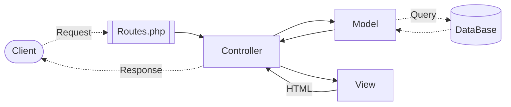
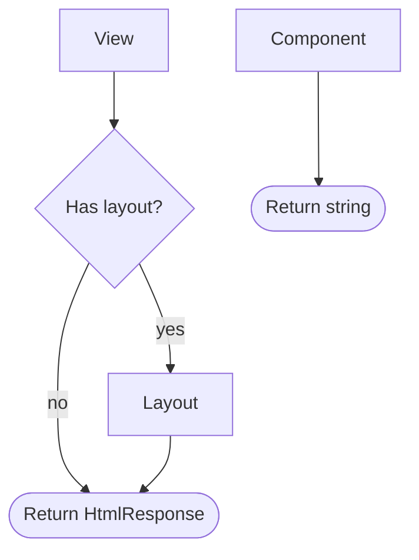
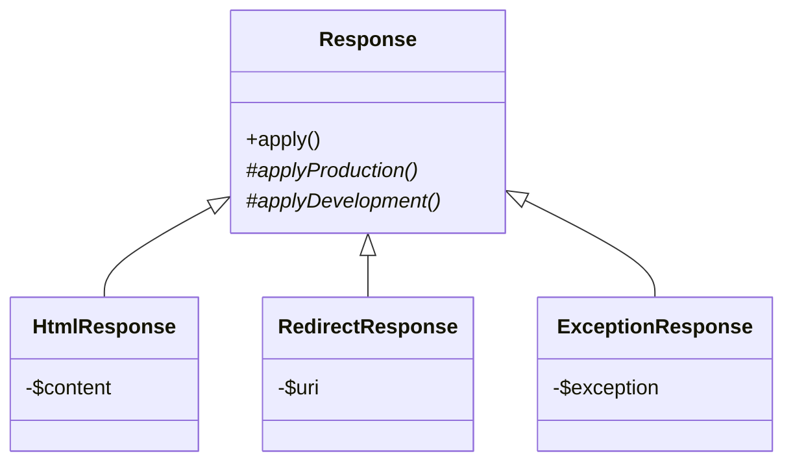

# Demo

## Introduction

- Social bullshit

## Explanation

- Blueprint cooking = recipe site
- Supports
  - recipes
  - categories
  - users
- First iteration
  - backend implemented

## Demonstration

- Home
  - 6 recipes
- Recipes
  - Show recipe
- Categories
  - Show category
  - navigate to recipe
- Users
  - edit user
  - delete user
  - create user
- Create recipe
  - Show edit for ingredient/step
- Login

# Technical demo

## Design

- Big part building core

## Code

- `Routes.php`
  - GET
  - RESOURCE 
- `UserController.php (Open right split)`
  - index
  - update
- `User` model
  - columns / table
  - relation to other table
- `User/index` view
  - variable available
  - saved in result

## Workflow

- Design / ER diagram
- GitHub
  - Issue
  - PR
- Naming conventions
- Documentation

# Questions

