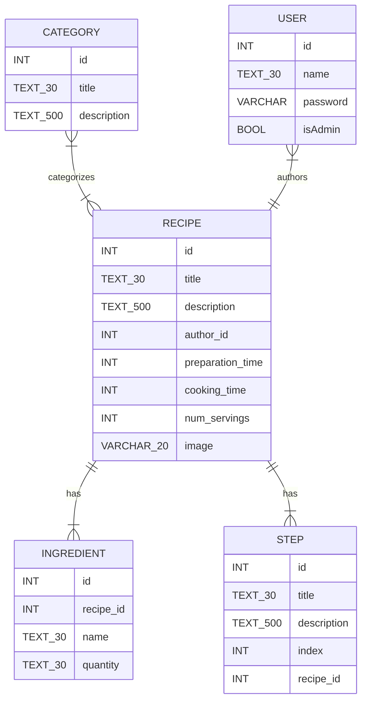

# Recipe Book: design

## Routes

- Home
- List (filtered?, pagination)
- Recipe CRUD
- Category admin CRUD (List route used for filtering)
- Admin login/logout

## Controllers

*CRUD:
- Index
- Show
- Create
- Store
- Edit
- Update
- Destroy

__Actual controllers:__

- Home
  - Index
- Recipe
  - *CRUD
- Category
  - *CRUD
- Auth
  - Login
  - Logout
- User
  - *CRUD

## Database

- Recipe
  - id
  - Title
  - Description
  - Author
  - Preparation time
  - Cooking time
  - Servings
  - Image
- Ingredient
  - id
  - Recipe id
  - name
  - quantity
- Step
  - title
  - description
  - index
  - Recipe id
- Category
  - id
  - title
  - description
- Category pivot
  - Category id
  - Recipe id
- User
  - id
  - name
  - password
  - isAdmin
